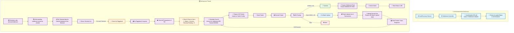

# Settlement Flow Process

```mermaid
flowchart TD
    %% Define styles for different node types
    classDef orchestration fill:#e1f5fe,stroke:#01579b,stroke-width:2px,color:#000
    classDef process fill:#f3e5f5,stroke:#4a148c,stroke-width:2px,color:#000
    classDef decision fill:#fff3e0,stroke:#e65100,stroke-width:2px,color:#000
    classDef success fill:#e8f5e9,stroke:#2e7d32,stroke-width:2px,color:#000
    classDef error fill:#ffebee,stroke:#c62828,stroke-width:2px,color:#000
    classDef dataFlow fill:#e3f2fd,stroke:#1565c0,stroke-width:2px,color:#000

    subgraph Orchestration["🔄 Orchestration/AutoSettlement"]
        A1["🌐 CardProcessor Service"] --> A2["⚙️ Settlement Controller"]
        A2 --> A3["💾 Insert/Update DB with status 3 Settlement Initiated"]
        A3 --> A4["✅ Return Accepted Status to Orchestration"]
    end

    subgraph Background["⏱️ Background Thread"]
        B1["🕒 Scheduler calls processSettlement"] --> B2["🔍 Fetch pending settlement entries by clientId"]
        B2 --> B3["📋 Get Terminal data for clientId Initialized & Not Blocked"]
        B3 --> B4["📱 Return Terminal List"]

        B4 --> |"For each Terminal"| B5["🔄 Check for Piggyback"]
        B5 --> B6["📤 Do Piggyback if required"]

        B6 --> B7["📊 Fetch All Transactions of TID"]
        B7 --> B8["✓ Check if Sent to Host = 1, Status = Success, Reversal Pending = 0"]

        B8 --> B9["🧮 Calculate Count & Amount for Settlement ISO Packet ISO0500"]
        B9 --> B10["📝 Prepare ISO Packet based on Switch Config"]
        B10 --> B11["📡 Send Packet"]
        B11 --> B12["📥 Receive Packet"]
        B12 --> B13["🔍 ISO Parsing"]

        B13 --> |"If DE33 = 00"| B14["✅ Success"]
        B13 --> |"Else if DE33 = 95"| B15["🔄 Do Batch Upload"]
        B13 --> |"Else"| B19["❌ Abort"]

        B15 --> B16["📦 Batch Upload List of Transactions"]
        B16 --> B17["🔂 Upload One by One: Prepare ISO Batch Upload 0320"]
        B17 --> B18["📤 Send Packet, Parse Response"]
        B18 --> |"If All Success"| B9
        
        B14 --> B20["📝 Prepare Settlement Final Packet ISO0500 MTI 0500"]
        B20 --> B21["🏦 Send to Bank"]
        B21 --> B22["✅ Mark Status in DB"]
    end

    %% Apply styles to nodes
    class A1,A2,A3,A4 orchestration
    class B1,B2,B3,B4,B6,B7,B9,B10,B11,B12,B13,B16,B17,B18,B20,B21,B22 process
    class B5,B8 decision
    class B14 success
    class B19 error
    class B15 dataFlow
```
